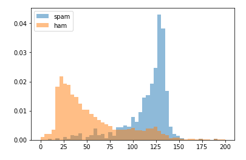
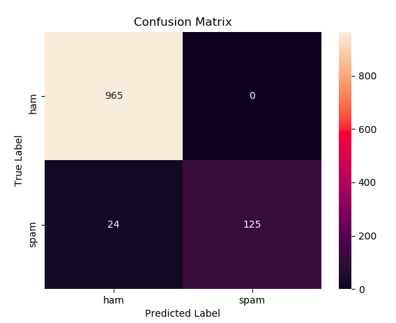

# spam-ham-detector

Using Spam detector using [Spam Ham dataset](https://archive.ics.uci.edu/ml/datasets/sms+spam+collection#)

## Feature engineering

### Length of text


### Capital Words
 

### Links in SMS
 

### Punctuation in SMS
 

## Results

```
    Precision: 1.0 / Recall: 0.839 / F1-Score: 0.912 / Accuracy: 0.978
```

### Confusion Matrix
